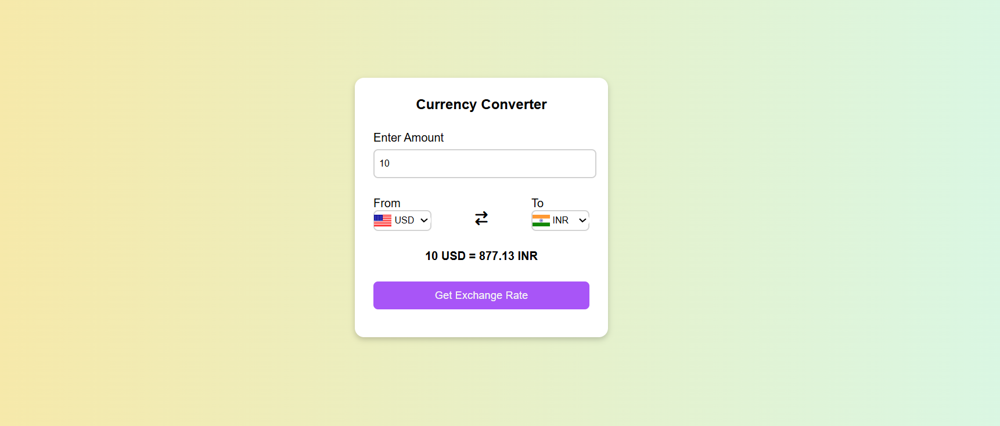

#  Currency Converter

A lightweight application to convert between currencies using real-time exchange rates and a user-friendly interface.

---

##  Features

- Fetches live exchange rates via a public API.
- Supports conversion between multiple currencies.
- Intuitive user interface:
  - Dropdowns to select source and target currencies.
  - Input field for amount.
  - Quick conversion results.

---

##  Tech Stack

- **HTML**, **CSS**, **JavaScript**
- Fetch API to retrieve live exchange rates
  
---
###  UI Screenshot

